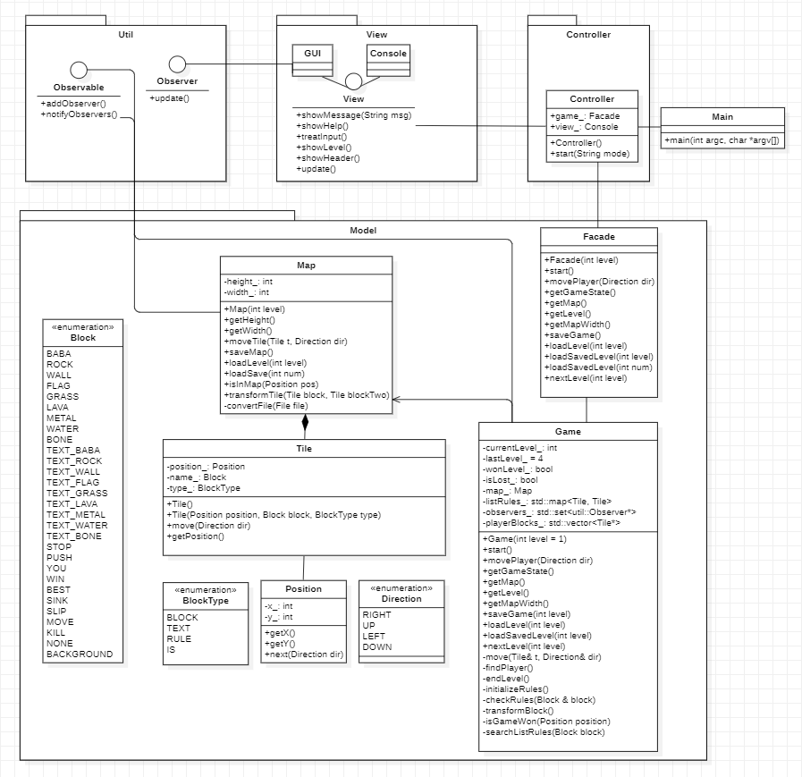

# Baba is You
DEV4 - 2022 / 2023  

## Developers
* Mossab DELBERGUE   
* Aurore VAN HOOREBEKE  
## Time estimations
* **Release 1:** 10h
* **Release 2:** 40h
* **Release 2:** _TBD_
# About

Our project is a reinterpretation of _Baba Is You_, a puzzle game whose rules are defined by blocks you can push around to try and solve the level. 
This project is based on the demo built during the 2017 Nordic Game Jam by Arvi Teikari.

**Languages & frameworks used** :
* C++ 20
* Catch2 (Testing)

# Project Structure

```
m-delbergue-a-van-hoorebeke/
├─ baba_is_you/
│  ├─ src/
│  ├─ tests/
│  ├─ CMakeLists.txt
|
├─ readme_assets/
├─ .gitignore
├─ Doxyfile
├─ README.md
```

# Setup
## On a working Qt Creator installation:
* Open the project (select CMakeFile in `baba_is_you\`)
* In project tab (on the left), select run, then check the "run in terminal" checkbox (important to be able to play)
* WARNING: if the `Failed to load save file.` or `Failed to load level file` errors show up, it means the relative paths to the files isn't correct. The problem occurs because the working directory of the executable is where the executable is located (in the configures "build" directory"). 

## Ubuntu
* Command-line compiling:
    ```bash
    g++ -pedantic-errors -Wall -Wuninitialized -std=c++2a block* console.* controller.* direction.h facade.* game.* main.* map.* observable.h observer.h position.* tile.* view.h -o baba_is_you
    ```
    (works on Ubuntu 20.04 LTS, with g++, c++ & gcc version 9.4.0)

# Class Diagram


## General
This project will use the classic MVC with Observable/Observer patterns, to give a coherent structure to the program and update the views at each update of the model (only for updates having a consequence on the visual aspect of the game).  
The game will contain two types of views: a console view, and a graphical interface made with `QWidget`.

The following sections will describe the different packages (represented as namespaces in the code) and their use, as well as the different classes. Some methods and attributes (such as contructors and getters) won't be described if their name is explicit enough.  

## Model

* **`Facade`** - Interface defining the authorized interactions between `Game` and `Controller`.

    - `movePlayer(Direction direction)` is a method moving the player in given direction.  
    The method will trigger a check to determine who is the player

    - `saveGame()` is a method triggering the saving of the map (calls `saveMap()` in `Map`)
    
    - `loadSavedLevel()` requests the loading of saved map, to resume playing
 the game as it was saved, if any save file was found (calls `loadSave()` in `Map`).

* **`Game`** - Class containing the main logic of the model: it defines when a map is loaded, saved or finalized.
`Game` also describes how the player (defined by the text_block associated with the "YOU" rule) moves, wins and keeps a list of all rules possible in the level.  

    -  `listRules` holds the rules possible in this level to keep track of what the player can and cannot do.

    - `move(Tile tile, Direction dir)` moves any given tile in given direction.
    It will trigger all kinds of other methods, including checks to determine if the move is allowed, check if some rules are disabled because of that move (eg. when a rule block or text_block is pushed), and if that move will end the game (player won or is dead).

    - `findPlayer()` checks which block is associated to the "YOU" rule and adds the first instance with that name to the `player` attribute.

* **`Map`** - Class representing the game's map (holds the map's contents and height & width information). The map is also responsible of loading its level informations from the game's files (`level*.txt` and `save*.txt`).
A map is made out of multiple `Tile` instances, and keeps these tiles in a `set`, sorted on the tile's position.

    * `saveMap()` is the method generating a `save*.txt` file (where `*` is the number of the save) containing the current state of the game  so that the player can resume playing later. 
    The save files will be written in the same format as `level*.txt` files to be able to load them with the same methods.

    * `loadLevel(int level)` is the method choosing the right level file according to the given level, if it exists. It will then call private method `convertFile` with that file as argument.

    * `loadSave(int num)` is the method feeding the save file number `num` to private method `convertFile`. Similar to loadLevel, but only for save files.

    * `convertFile(File file)` reads the requested file line by line, and fills ´Map´'s attributes with read informations.
    
* **`Tile`** - Class representing a "meaningful" block in the game (anything that isn't the black background of the game).
    
    * `name`: the name of the block represented, matches the names found in the level and save files loaded in map.

    * `type`: the role of the block in the game.
    
    * `isUnique` attribut set to `true` if this instance is the only one with this name on the map.
    Ex: BABA is unique, but ROCK isn't necessarily.

    *  `move(Direction dir)` moves the position of the tile in the given direction. 

    
* **`Direction`** - Enumeration holding the possible directions to move in the game. The enum values are ordered so that their default integer values stay identical to the ones used in the game file (use of default enum classes behaviour in C++).  
`RIGHT` = 0, `UP` = 1, `LEFT` = 2, `DOWN` = 3.

* **`Position`** - Class representing a position on the x and y axis in the game. 
    * `next(Direction dir)` gives the next position if given direction.  

    
* **`Block`** - Enumeration defining the possible blocks in the game. The names stored in the enum are the uppercase representation of the names found in the level and save files.
The blocks are sorted by type.
C++ enum class.

* **`BlockType`** - Enumeration with the possible types of blocks in the game. A block type is basically the role of a given block in the game (RULE block, TEXT block (textual representation of a BLOCK used to form a rule), or a regular BLOCK (such as baba, a rock, a wall, ...))

## View

Contains a `View` interface defining the general behaviour of both console and graphical interface views (`Console` and `GUI`).  
Both view types implement that interface in their own way.

## Controller

Contains the controller for the game. `Controller` is the link between the view and the model for all the information that shouldn't be shared directly between an observer and its observable.  

## Util

`Observable` and `Observer` are the two interfaces defining the behaviour of observers and observables in the project. We chose not to add any method to remove an observer from an observable's list since it didn't seem to apply to this project in particular.

# Known issues
* We make use of colors in the console. Depending on the default console of your OS, it might not show properly:
    * WORKS ON:
        * Qt's terminal (Projects > run > run in terminal) on Windows 11,
        * Ubuntu 20.04LTS's terminal
    * DOESN'T WORK ON:
        *  Windows 10's cmd.
* NOT IMPLEMENTED: If the player is a group of tiles (e.g. `ROCK IS YOU`), the player shouldn't directly die if one of the tiles hits a tile bound to a "`IS SINK`" or a "`IS KILL`" rule.